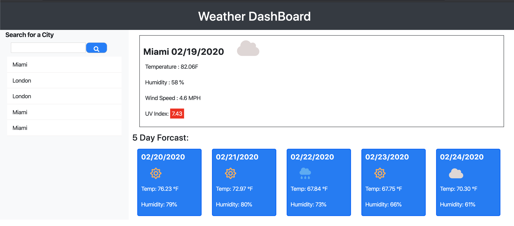
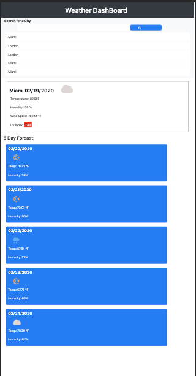

# OpenWeatherApi
In this project I used 3 Api's from Openweathermap.org to retrieve information about weather for a certain area, input by user, for the 1 day forecast, the uv index for the current , and 5 day forecast. This information is then displayed on the screen and the location added to a list of previously searched cities.
This website is fully responsive through the use of bootstrap columns and rows, and uses local storage so the previous searches list (up to 5 ) and weather data for last searched city persist through a refresh.
https://cfech.github.io/OpenWeatherApi/

